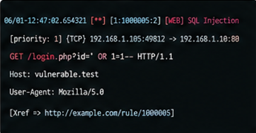
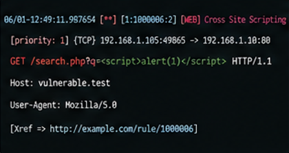
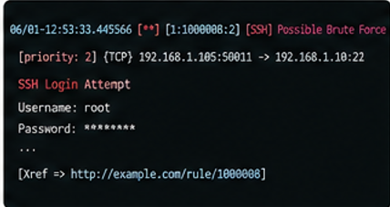

# Snort Custom IDS/IPS Rules


<p align="center">
  
</p>

<h1 align="center">🛡️ Snort Custom IDS/IPS Rules</h1>

<p align="center">
Enterprise-grade Snort 3 IDS/IPS detection rules for identifying reconnaissance, web application attacks, brute-force attempts, malware activity, command-and-control traffic, DNS abuse, SMB attacks, and data exfiltration. Designed, tested, and validated on Kali Linux using Snort 3.
</p>

---

# 📖 Overview

Modern enterprise networks face continuous threats from attackers performing reconnaissance, brute-force attacks, web exploitation, malware deployment, and data theft.

This project provides a collection of professionally written custom Snort IDS/IPS rules designed to detect these attack techniques in real-time.

It is intended for:

- SOC Analysts
- Blue Team Engineers
- Cybersecurity Students
- Detection Engineers
- Network Security Professionals

---

# ✨ Features

- TCP SYN Port Scan Detection
- ICMP Flood Detection
- Directory Traversal Detection
- Linux `/etc/passwd` Access Detection
- SQL Injection Detection
- Cross Site Scripting (XSS)
- FTP Brute Force Detection
- SSH Brute Force Detection
- SMB Access Detection
- DNS Tunneling Detection
- DNS Amplification Detection
- SQLMap Detection
- Nikto Detection
- Nmap XMAS Scan Detection
- Reverse Shell Detection
- Large HTTP POST Detection
- IPS Blocking Rules

---

# 🏗️ Network Architecture

<p align="center">

</p>

Traffic is inspected by the Snort Detection Engine using the custom rule set. Matching packets generate alerts that can be reviewed by security analysts or forwarded to SIEM platforms.

---

# 🔄 Detection Workflow

<p align="center">

</p>

The workflow consists of:

1. Packet Capture
2. Packet Preprocessing
3. Rule Matching
4. Alert Generation
5. Logging & Analysis

---

# 📂 Repository Structure

```text
SNORT-CUSTOM-IDS-RULES
│
├── configs
│   └── snort.conf.example
│
├── docs
│   ├── Installation.md
│   ├── Configuration.md
│   ├── Rule-Explanation.md
│   └── Testing.md
│
├── images
│
├── rules
│   └── custom.rules
│
├── scripts
│   ├── install.sh
│   ├── validate.sh
│   └── run-snort.sh
│
├── test-pcaps
│
├── .gitignore
├── LICENSE
└── README.md
```

---

# ⚙️ Requirements

- Linux (Ubuntu / Kali)
- Snort 2.9.x or later
- Root Privileges
- libpcap
- Configured Network Interface

---

# 🚀 Installation

Clone the repository

```bash
git clone https://github.com/YOUR_USERNAME/snort-custom-ids-rules.git

cd snort-custom-ids-rules
```

Copy the rule file

```bash
sudo cp rules/custom.rules /etc/snort/rules/
```

Open the Snort configuration

```bash
sudo nano /etc/snort/snort.conf
```

Include the custom rules

```conf
include $RULE_PATH/custom.rules
```

---

# ✅ Validate Configuration

```bash
sudo snort -T -c /etc/snort/snort.conf
```

Expected Output

```
Snort successfully validated the configuration.
```

---

# ▶️ Run Snort

```bash
sudo snort -A console \
-c /etc/snort/snort.conf \
-i eth0
```

Replace **eth0** with your monitoring interface.

---

# 🧪 Testing Examples

## TCP SYN Scan

```bash
nmap -sS <Target-IP>
```

---

## SQL Injection

```
http://target/login.php?id=' OR 1=1--
```

---

## Cross Site Scripting

```
<script>alert(1)</script>
```

---

## FTP Brute Force

```bash
hydra -l admin -P rockyou.txt ftp://<Target-IP>
```

---

## SSH Brute Force

```bash
hydra -l root -P rockyou.txt ssh://<Target-IP>
```

---

# 📊 Detection Coverage

| Attack | Detection |
|----------|-----------|
| TCP SYN Scan | ✅ |
| ICMP Flood | ✅ |
| Directory Traversal | ✅ |
| SQL Injection | ✅ |
| Cross Site Scripting | ✅ |
| FTP Brute Force | ✅ |
| SSH Brute Force | ✅ |
| SMB Detection | ✅ |
| DNS Tunneling | ✅ |
| DNS Amplification | ✅ |
| SQLMap Detection | ✅ |
| Nikto Detection | ✅ |
| Reverse Shell | ✅ |
| Data Exfiltration | ✅ |

---

# 📸 Demonstration

## Snort Startup

<p align="center">

</p>

---

## TCP SYN Port Scan Detection

<p align="center">

</p>

---

## SQL Injection Detection

<p align="center">

</p>

---

## Cross Site Scripting Detection

<p align="center">

</p>

---

## FTP Brute Force Detection

<p align="center">

</p>

---

## SSH Brute Force Detection

<p align="center">

</p>

---

# 📚 Documentation

Complete documentation is available in the **docs** directory.

| File | Description |
|------|-------------|
| Installation.md | Snort Installation Guide |
| Configuration.md | Snort Configuration |
| Rule-Explanation.md | Explanation of every rule |
| Testing.md | Step-by-step testing procedures |

---

# 🛠 Future Improvements

- Snort 3 Support
- Suricata Compatible Rules
- Additional Malware Signatures
- Threat Intelligence Integration
- SIEM Integration Examples
- Automated PCAP Testing
- Community Rule Contributions

---

# 🤝 Contributing

Contributions are welcome.

1. Fork this repository.
2. Create a feature branch.
3. Commit your changes.
4. Push your branch.
5. Open a Pull Request.

---

# ⚠️ Disclaimer

These rules are provided for educational purposes and authorized security assessments only.

The author is not responsible for misuse of this project.

---

# 📄 License

This project is licensed under the MIT License.

See the **LICENSE** file for details.

---

# 👨‍💻 Author

**Swastik Garg**

B.Tech — Internet of Things & Cyber Security

Cybersecurity Enthusiast | Blue Team | SOC | Network Security | Detection Engineering

---

<p align="center">

⭐ If you found this repository useful, please consider giving it a Star.

</p>