# Snort Custom IDS/IPS Rules


<p align="center">
  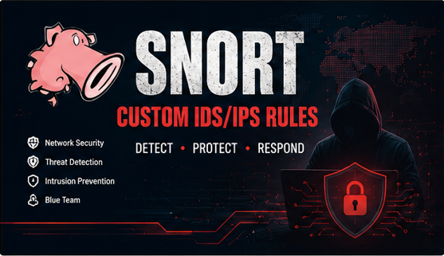
</p>

<h1 align="center">🛡️ Snort Custom IDS/IPS Rules</h1>

<p align="center">
Custom Snort 3 IDS detection rules for detecting reconnaissance, authentication attacks, DNS abuse, SMB activity, malware indicators, command-and-control traffic, and data exfiltration. Developed and tested using Snort 3 on Kali Linux.
</p>

---

# 📖 Overview

Modern enterprise networks face continuous threats from attackers performing reconnaissance, network scanning, authentication attacks, malware deployment, command-and-control communications, and data exfiltration.

This project provides a collection of custom Snort 3 detection rules for identifying reconnaissance activity, network scanning, authentication attacks, DNS abuse, SMB activity, malware indicators, command-and-control traffic, reverse shells, and suspicious network behavior.

It is intended for:

- SOC Analysts
- Blue Team Engineers
- Cybersecurity Students
- Detection Engineers
- Network Security Professionals

---

# 🛠 Technologies

- Snort 3
- Kali Linux
- Git
- GitHub
- Bash
- TCP/IP
- IDS/IPS

---

# ✨ Features

- TCP SYN Scan Detection
- TCP FIN Scan Detection
- TCP NULL Scan Detection
- TCP XMAS Scan Detection
- UDP Scan Detection
- ICMP Flood Detection
- Directory Traversal Detection
- Linux /etc/passwd Access Detection
- FTP Brute-Force Detection
- SSH Brute-Force Detection
- SMB Activity Detection
- DNS Tunneling Detection
- Large File Transfer Detection
- Reverse Shell Detection
- Malware & Command-and-Control Indicators
- Policy Violation Detection

---

# 🏗️ Network Architecture

<p align="center">
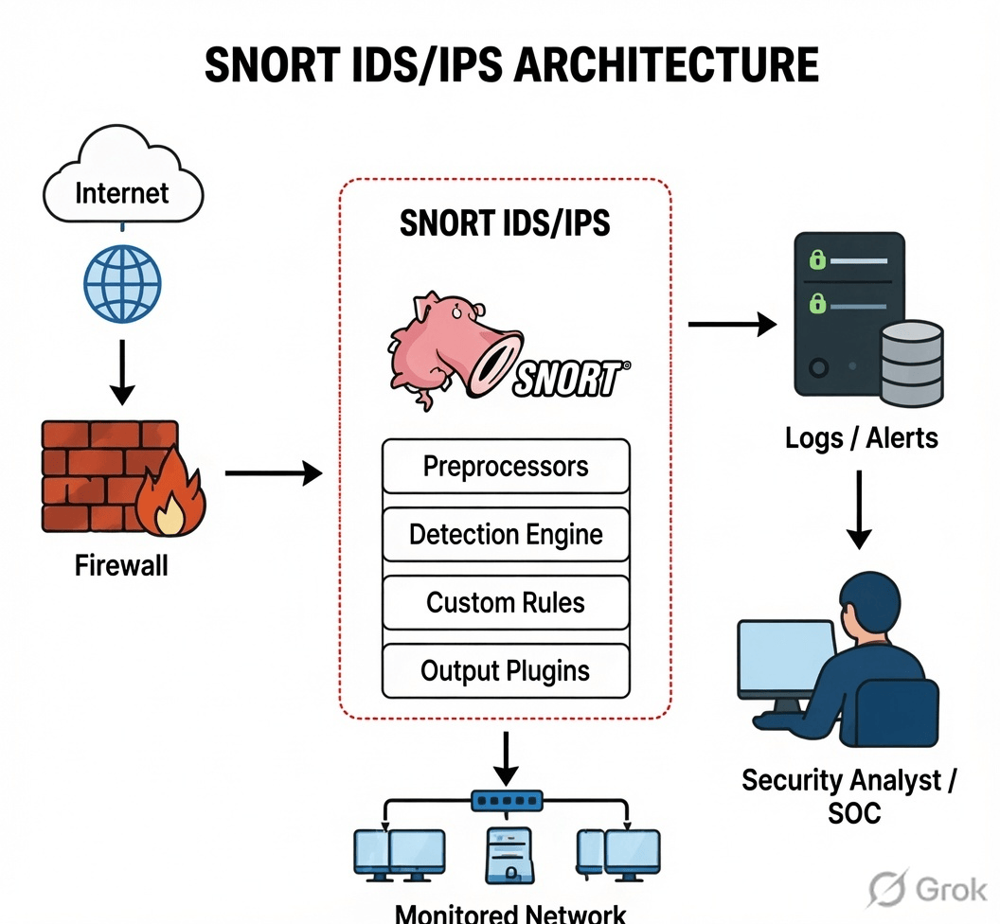
</p>

Traffic is inspected by the Snort Detection Engine using the custom rule set. Matching packets generate alerts that can be reviewed by security analysts or forwarded to SIEM platforms.

---

# 🔄 Detection Workflow

<p align="center">
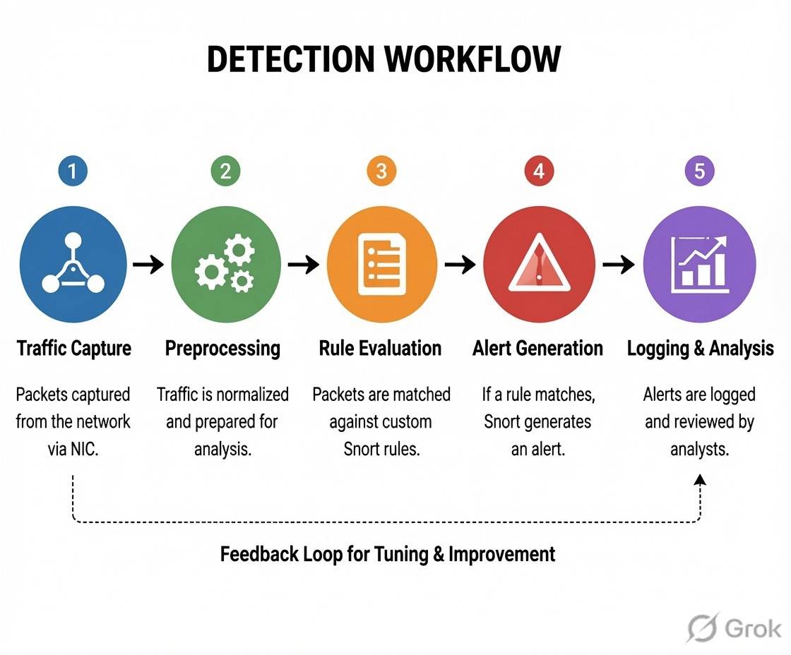
</p>

The workflow consists of:

1. Packet Capture
2. Packet Preprocessing
3. Rule Matching
4. Alert Generation
5. Logging & Analysis

---

# 📂 Repository Structure

```text
SNORT-CUSTOM-IDS-RULES
│
├── configs
│   └── snort.conf.example
│
├── docs
│   ├── Installation.md
│   ├── Configuration.md
│   ├── Rule-Explanation.md
│   └── Testing.md
│
├── images
│
├── rules
│   └── custom.rules
│
├── scripts
│   ├── install.sh
│   ├── validate.sh
│   └── run-snort.sh
│
├── test-pcaps
│
├── .gitignore
├── LICENSE
└── README.md
```

---

# ⚙️ Requirements

- Snort 3.x
- Kali Linux 2025+ (recommended)
- Root privileges
- libpcap
- Network interface in promiscuous mode (for live monitoring)

---

# 🚀 Installation

Prerequisite: Install Snort 3 before using this rule set. This repository contains only custom detection rules and supporting documentation.

Clone the repository

```bash
git clone https://github.com/Swastik-Garg/SNORT-CUSTOM-IDS-RULES.git

cd SNORT-CUSTOM-IDS-RULES
```

Copy the rule file

```bash
sudo cp rules/custom.rules /etc/snort/rules/
```

Edit the Snort configuration:

```bash
sudo nano /etc/snort/snort.lua
```

Inside the `ips` section add:

```lua
ips =
{
    rules = [[
        include /etc/snort/rules/custom.rules
    ]]
}
```

---

# ✅ Validate Configuration

```bash
sudo snort -T -c /etc/snort/snort.lua
```

Expected Output

```
Snort successfully validated the configuration.
```

---

# ▶️ Run Snort

```bash
sudo snort \
-c /etc/snort/snort.lua \
-i eth0 \
-A alert_fast
```

Replace **eth0** with your monitoring interface.

---

# 🧪 Testing Examples

## TCP SYN Scan

```bash
sudo nmap -sS <Target-IP>
```

---

## TCP FIN Scan

```bash
sudo nmap -sF <Target-IP>
```
---

## TCP NULL Scan

```bash
sudo nmap -sN <Target-IP>
```
---

## TCP XMAS Scan

```bash
sudo nmap -sX <Target-IP>
```
---

### ICMP Flood

```bash
sudo hping3 --icmp --flood <Target-IP>
```
OR 

```bash
ping -f <Target-IP>
```

---

## FTP Brute Force

```bash
hydra -l admin -P rockyou.txt ftp://<Target-IP>
```

---

## UDP Port Scan

```bash
sudo nmap -sU --top-ports 20 <Target-IP>
```

---


# 📊 Detection Coverage

| Attack | Detection |
|----------|-----------|
| TCP SYN Scan | ✅ |
| ICMP Flood | ✅ |
| Directory Traversal | ✅ |
| FTP Brute Force | ✅ |
| SMB Detection | ✅ |
| DNS Tunneling | ✅ |
| DNS Amplification | ✅ |
| Data Exfiltration | ✅ |

---

# 📈 Project Statistics

| Metric | Value |
|---------|------:|
| Snort Version | 3.x |
| Custom Rules | 31 |
| Attack Categories | 10+ |
| Documentation Files | 4 |
| Tested Platform | Kali Linux |
| License | MIT |

---

# 📸 Demonstration

## Snort Startup

<p align="center">
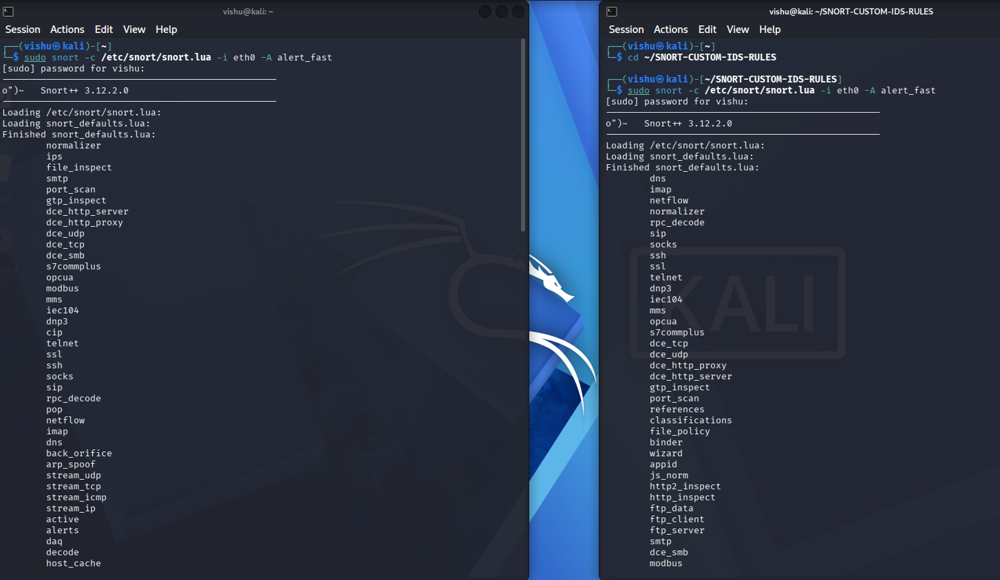
</p>

---

## TCP SYN Port Scan Detection

<p align="center">
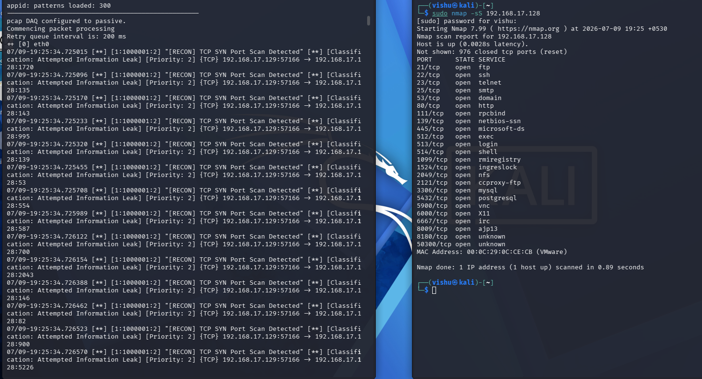
</p>

---

## TCP FIN Scan Detection

<p align="center">
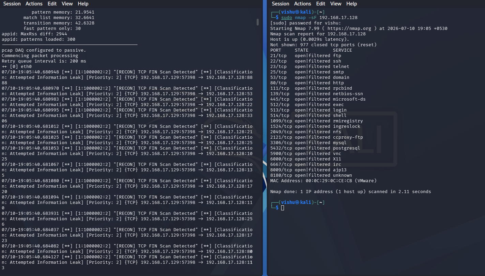
</p>

---

## TCP NULL Scan Detection

<p align="center">
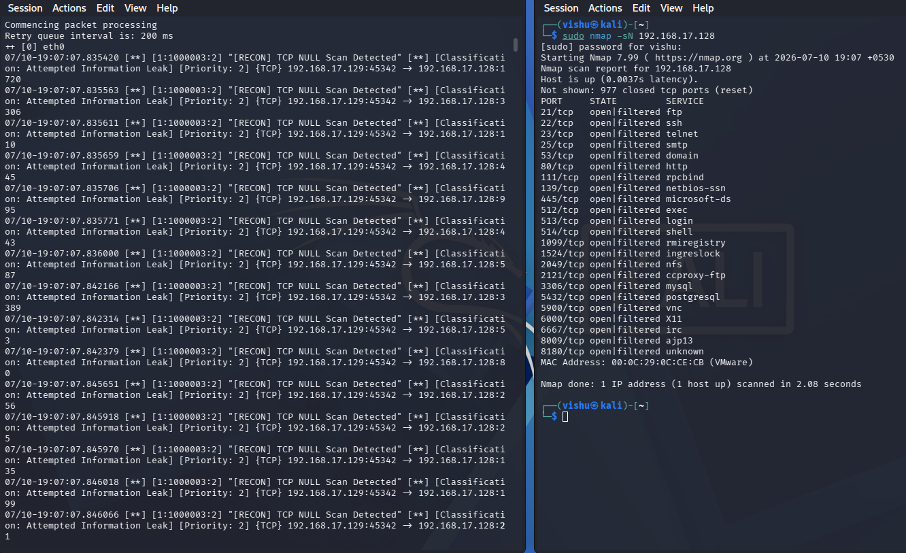
</p>

---

## TCP XMAS Scan Detection

<p align="center">
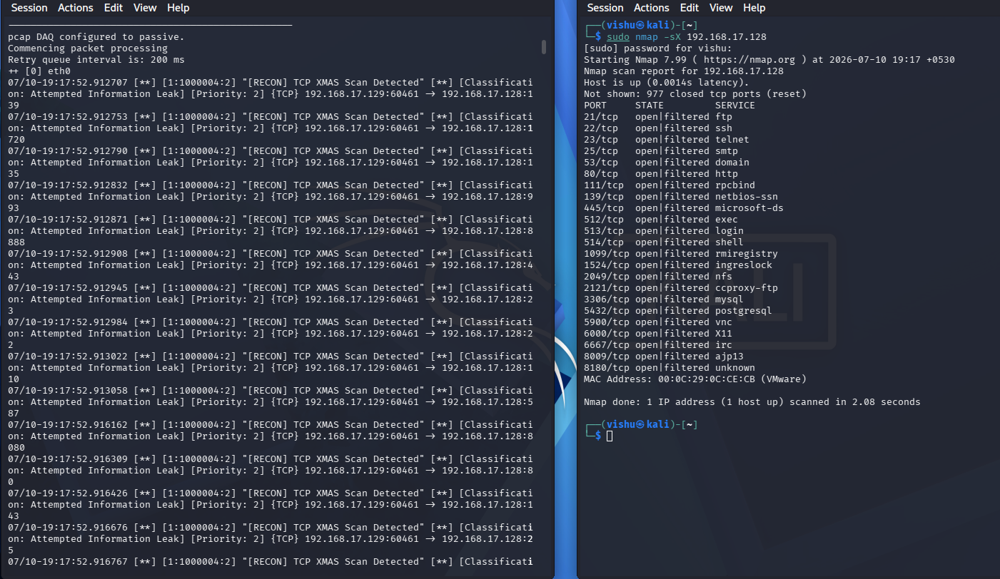
</p>

---

## ICMP Flood Detection

<p align="center">
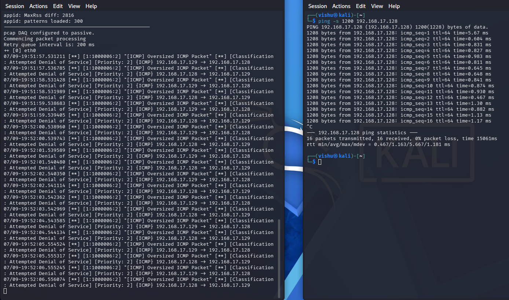
</p>

---

## FTP Brute Force Detection

<p align="center">
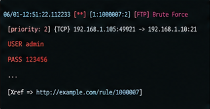
</p>

---

## UDP Port Scan Detection

<p align="center">
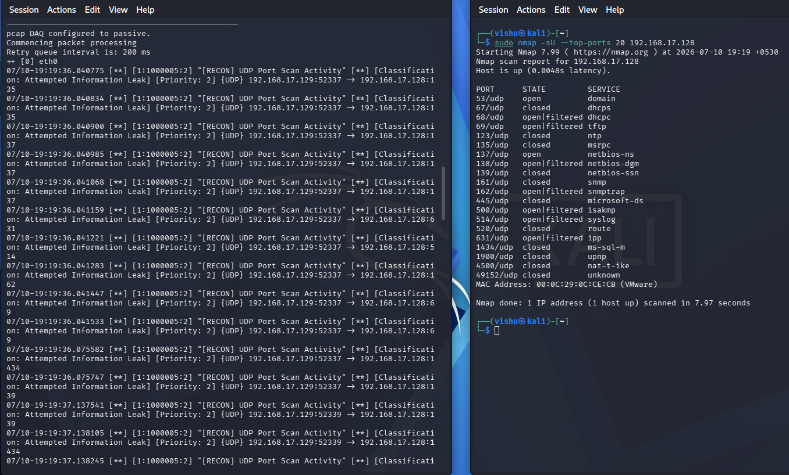
</p>

---


# 📚 Documentation

Complete documentation is available in the **docs** directory.

| File | Description |
|------|-------------|
| Installation.md | Snort Installation Guide |
| Configuration.md | Snort Configuration |
| Rule-Explanation.md | Explanation of every rule |
| Testing.md | Step-by-step testing procedures |

---

# 🛠 Future Improvements

- Additional malware signatures
- More reconnaissance detection rules
- TLS and HTTP protocol inspection
- PCAP-based automated rule testing
- GitHub Actions CI validation
- SIEM integration examples
- MITRE ATT&CK mapping

---

# 🤝 Contributing

Contributions are welcome.

1. Fork this repository.
2. Create a feature branch.
3. Commit your changes.
4. Push your branch.
5. Open a Pull Request.

---

# ⚠️ Disclaimer

These rules are provided for educational purposes and authorized security assessments only.

The author is not responsible for misuse of this project.

---

# 📄 License

This project is licensed under the MIT License.

See the **LICENSE** file for details.

---

# 🎯 Learning Outcomes

This project demonstrates practical skills in:

- Network Intrusion Detection
- Detection Engineering
- Snort 3 Rule Development
- Linux System Administration
- Network Traffic Analysis
- Cyber Threat Detection
- Git & GitHub Version Control
- Security Documentation

---

# 👨‍💻 Author

**Swastik Garg**

B.Tech — Internet of Things & Cyber Security

Cybersecurity Enthusiast | Blue Team | SOC | Network Security | Detection Engineering

---

<p align="center">

⭐ If you found this repository useful, please consider giving it a Star.

</p>